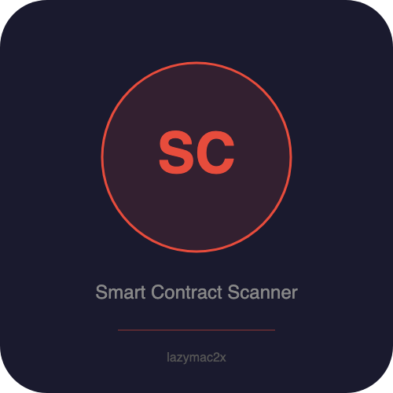

<p align="center"></p>

[](https://lazymac2x.github.io/lazymac-api-store/) [](https://coindany.gumroad.com/) [](https://mcpize.com/mcp/smart-contract-scanner-api)

# Smart Contract Scanner API

> ⭐ **Building in public from $0 MRR.** Star if you want to follow the journey — [lazymac-mcp](https://github.com/lazymac2x/lazymac-mcp) (42 tools, one MCP install) · [lazymac-k-mcp](https://github.com/lazymac2x/lazymac-k-mcp) (Korean wedge) · [lazymac-sdk](https://github.com/lazymac2x/lazymac-sdk) (TS client) · [api.lazy-mac.com](https://api.lazy-mac.com) · [Pro $29/mo](https://coindany.gumroad.com/l/zlewvz).

[](https://www.npmjs.com/package/@lazymac/mcp)
[](https://smithery.ai/server/lazymac/mcp)
[](https://coindany.gumroad.com/l/zlewvz)
[](https://api.lazy-mac.com)

> 🚀 Want all 42 lazymac tools through ONE MCP install? `npx -y @lazymac/mcp` · [Pro $29/mo](https://coindany.gumroad.com/l/zlewvz) for unlimited calls.

Premium Solidity smart contract vulnerability scanner — REST API and MCP server. Detects 13 vulnerability classes using pattern-based analysis with zero external dependencies.

## Why This Exists

Professional smart contract audits cost $5K–$50K and take weeks. This API provides automated, instant security analysis for a fraction of the cost. No external API keys needed — all analysis is done locally via pattern matching and structural analysis.

## Vulnerability Detection

| ID | Name | Severity | SWC |
|---|---|---|---|
| SCS-001 | Reentrancy | Critical | SWC-107 |
| SCS-002 | Integer Overflow/Underflow | High | SWC-101 |
| SCS-003 | Unchecked External Calls | High | SWC-104 |
| SCS-004 | Access Control | Critical | SWC-105 |
| SCS-005 | Timestamp Dependence | Medium | SWC-116 |
| SCS-006 | tx.origin Authentication | Critical | SWC-115 |
| SCS-007 | Delegatecall Injection | Critical | SWC-112 |
| SCS-008 | Self-destruct | High | SWC-106 |
| SCS-009 | Floating Pragma | Low | SWC-103 |
| SCS-010 | Gas Limit Issues | Medium | SWC-128 |
| SCS-011 | Front-running | Medium | SWC-114 |
| SCS-012 | Missing Events | Low | N/A |
| SCS-013 | Unused Variables | Info | SWC-131 |

## Quick Start

```bash
npm install
npm start        # REST API on port 5200
npm run mcp      # MCP server (stdio)
npm test         # Run test suite
```

## API Endpoints

### POST /api/v1/scan — Full Audit

```bash
curl -X POST http://localhost:5200/api/v1/scan \
  -H "Content-Type: application/json" \
  -d '{"code": "pragma solidity ^0.8.0; contract Foo { function withdraw() public { msg.sender.call{value: 1}(\"\"); } }"}'
```

Returns: Full audit report with risk score (0–100), findings grouped by severity, gas optimization suggestions, and actionable recommendations.

### POST /api/v1/quick-scan — Critical Checks Only

Same request format. Checks only the top 5 critical patterns (reentrancy, access control, tx.origin, delegatecall, unchecked calls). Faster response.

### POST /api/v1/gas-analysis — Gas Optimization

Returns gas optimization suggestions with estimated savings per suggestion.

### GET /api/v1/vulnerabilities — Detector Catalog

Lists all 13 detectable vulnerability types with descriptions and SWC references.

## MCP Server

Add to your MCP client configuration:

```json
{
  "mcpServers": {
    "smart-contract-scanner": {
      "command": "node",
      "args": ["src/mcp-server.js"],
      "cwd": "/path/to/smart-contract-scanner-api"
    }
  }
}
```

**Tools:**
- `scan_contract` — Full security audit
- `quick_scan_contract` — Critical checks only
- `analyze_gas` — Gas optimization analysis
- `list_vulnerabilities` — Detector catalog

## Report Format

```json
{
  "report": {
    "overview": {
      "riskScore": 78,
      "riskLevel": "High",
      "summary": { "total": 8, "critical": 2, "high": 3, "medium": 2, "low": 1, "info": 0 }
    },
    "findings": { "bySeverity": { ... }, "total": 8 },
    "gasOptimization": { "suggestions": [...] },
    "recommendations": [...]
  }
}
```

## Docker

```bash
docker build -t smart-contract-scanner .
docker run -p 5200:5200 smart-contract-scanner
```

## License

MIT

<sub>💡 Host your own stack? <a href="https://m.do.co/c/c8c07a9d3273">Get $200 DigitalOcean credit</a> via lazymac referral link.</sub>
